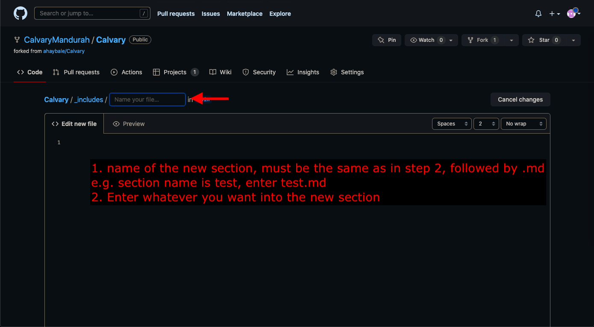

# Instructions on how to use and change the Calvary Website
## Setup

1. Sign in to [Github.com](https://github.com/login) and enter the username and password

2. Go to the CalvaryMandurah/Calvary folder 

3. Open the `_includes` Folder 

4. Select the section you want to edit and open the corresponding file

## Making Changes

1. Start editing the document by clicking the pencil

2. Make the changes you want to

3. Commit your changes after stating the changes you made in the first box

## Adding a new section

1. open readme.md

2. add new section

3. open `_includes` folder

4. Create new file

5. name file and insert content

6. Commit changes

## Adding photos
pls no

## Status of the website
1. Go to actions
2. if the dot is yellow changes are still being made. If its green it has been saved. 
    Depending on your internet connection and the company hosting the website changes can be saved but still take a long time to show up, most of the time, if its green its done though

## Markdown Basics
### Headings
To create a heading, add number signs (#) in front of a word or phrase. The number of number signs you use should correspond to the heading level. Only use 2 to 6 hashtags

### Paragraphs
Text can be entered to be inserted in a normal paragraph (This is mostly what i think you'll be doing)

### Line Break
End the line with 2 spaces and then press enter/return.  
This is done above.

### **Bold** and *italic* Text
Use double asteriks (**) before and after the letters/words you want to bold. 
Use single asteriks (*) before and after the letters/words you want to italicize. 

### Blockquotes 
> This is what a blockquote looks like, it is created by begining the line with >

> Multiline blockquotes can be created by starting each consequtive line with >
>
> this is a multiline blockquote

### Lists
#### Numbered lists
1. Start lines with a number followed by a period (1.)
2. This is line 2

#### Dot pointed lists
* Start each line with either an asteriks 
- or a minus sign 
+ or plus sign  

#### Indented Lists
Lists (numbered or dot points), can be indented simply by indenting them. 
1. line 1
    1. line 2
    2. line3 
2. line 4

